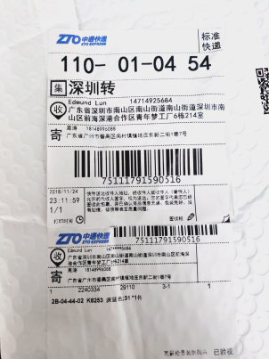

## Chinese OCR
> 2018-10-19 fri

run `python det_recog.py`

#### update
:point_right: update 2018-10-23 Tuesday (single line)

- before

- after

:point_right: update  2018-12-03 Monday (full image correct==username phone(4) address)

- full image

- result:

:point_right: update 2018-12-12 Wed ([det_recog_api](./det_recog_api.py))

#### example

- detection

- recognition

